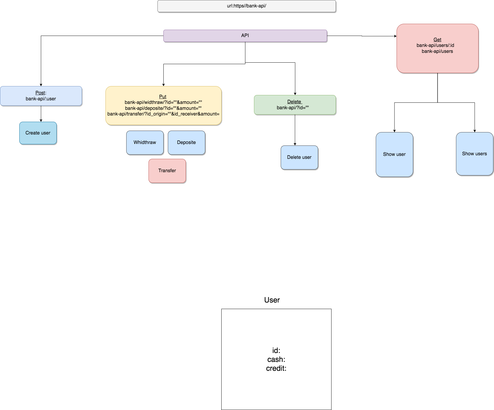

# BankApi-NodeJS-Mongoose-Atlas-Full-Stack-weekend project

## Table of Contents

- [About](#about)
- [Getting Started](#getting_started)
- [Usage](#usage)
- [Contributing](../CONTRIBUTING.md)

## About 

The following exercise contains the following subjects:

Full stack project:

DEMO: https://dashboard.heroku.com/apps/bank-api-mongoose-atlas

Front-end:

1. React

Backend:

2. Express
3. Mongoose
4. Atlas - mongoDB cloud
5. Heroku - deployment

We are going to build a bank API - Full stack project.

The manager has access to the users of the bank and can do
the following:
Add users
Can add users to the bank. Each user has the following:
passport id, cash(default 0), credit(default 0).
Depositing
Can deposit cash to a user. (by the users passport id and
amount of cash)
Update credit
Can update a users credit (only positive numbers)
Withdraw money
Can withdraw money from the user (can withdraw money until
the cash and credit run out)
Transferring
Can transfer money from one user to another with credit(can
transfer money until the cash and credit run out)
Show details of user
Can fetch all details of a particular user
Show details of all users
Can fetch all details of all the users
Use cases:

1. Cannot add duplicate users
2. When fetching users, make sure they exist.
3. Any other use cases?(hint: there are!)
   If the use cases are not sufficient send an appropriate error
   message to the client.

## Getting Started 

node app.js

### Prerequisites

Have to install express, mongoose, concurrently, cors, dotenv, nodemon, axios

### Installing

npm i express mongoose concurrently cors dotenv nodemon axios

react: npx create-react-app client

## Usage 

How to use the system - see picture.
In future it's good to add:

Filter the users

1. Can fetch users by amount of cash they have.
2. Think of something else to filter.
   Add a new field for a user: IsActive
   IsActive determines if the account is active or not.
3. If the user is not active, you cannot do anything with that
   user.
4. Fetch the users that are active and have a specified amount
   of cash.

   
